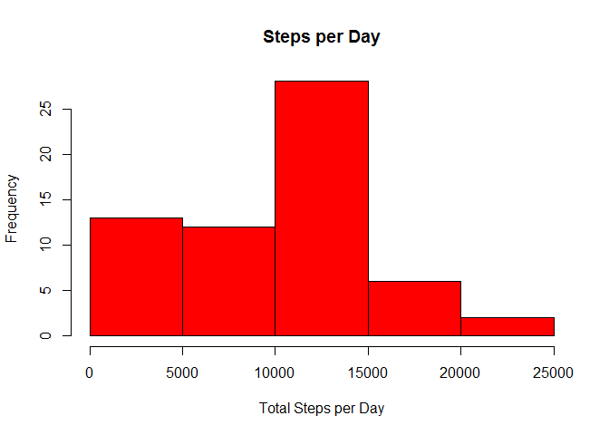
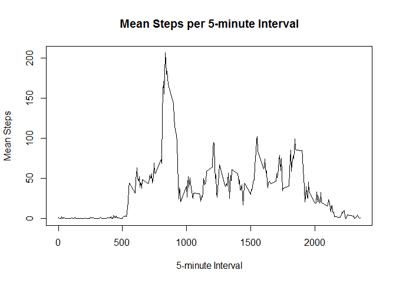
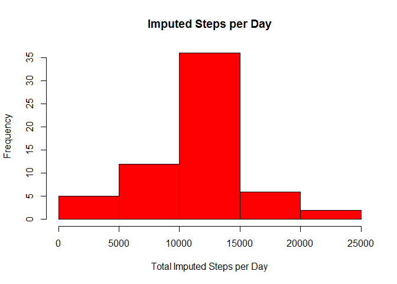
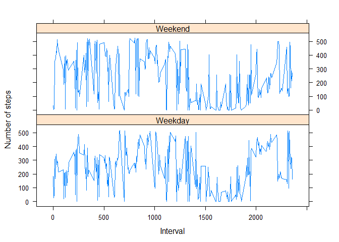

# Reproducible Research: Peer Assessment 1


## Loading and preprocessing the data

```r
#load data and libraries

fileUrl <- "https://github.com/bhill-10/RepData_PeerAssessment1/blob/master/activity.zip?raw=true"
setInternet2(TRUE)
download.file(fileUrl, destfile ="./activity.zip", method = "auto", mode = "wb")
unzip ("activity.zip")
data <- read.csv("activity.csv", header = TRUE, na.strings = NA)

library(lubridate)
library(dplyr)
```

```
## 
## Attaching package: 'dplyr'
## 
## The following objects are masked from 'package:lubridate':
## 
##     intersect, setdiff, union
## 
## The following object is masked from 'package:stats':
## 
##     filter
## 
## The following objects are masked from 'package:base':
## 
##     intersect, setdiff, setequal, union
```

```r
library(plyr)
```

```
## -------------------------------------------------------------------------
## You have loaded plyr after dplyr - this is likely to cause problems.
## If you need functions from both plyr and dplyr, please load plyr first, then dplyr:
## library(plyr); library(dplyr)
## -------------------------------------------------------------------------
## 
## Attaching package: 'plyr'
## 
## The following objects are masked from 'package:dplyr':
## 
##     arrange, count, desc, failwith, id, mutate, rename, summarise,
##     summarize
## 
## The following object is masked from 'package:lubridate':
## 
##     here
```

```r
library(lattice)
library(ggplot2)
library(xtable)

#change to date from factor to date 
data$date <- ymd(data$date)
```


## What is mean total number of steps taken per day?
Here is the code to calculate the mean total number of steps per day:

```r
#1 calculate total steps per day 
steps_per_day <-tapply(data$steps, data$date, sum,na.rm = TRUE)
```


Let's look at a histogram:

```r
#2 make histogram of total steps per day
hist(steps_per_day, xlab = "Total Steps per Day", col = "red",
     main = "Steps per Day")
```

 


```r
#3 calculate mean and median steps per day
mean_steps_day <- round(mean(steps_per_day),2)
median_step_day <- median(steps_per_day)
```
The mean steps per day is 9354.23, and the median steps per day is
10395.

## What is the average daily activity pattern?

```r
# calculate mean per interval
mean_interval <- tapply(data$steps, data$interval, mean, na.rm = TRUE)

#make line graph of mean steps per 5-minute Interval
plot(unique(data$interval), mean_interval, type = 'l', 
     xlab = "5-minute Interval", 
     ylab = "Mean Steps", 
     main = "Mean Steps per 5-minute Interval"
)
```

 

```r
#calculate which 5-minute interval has the most steps on average--PRINT VALUE
max_steps_interval<- unique(data$interval)[which.max(mean_interval)]
```
The 835 interval has the most steps on average.

## Imputing missing values

```r
#1 total number of NA rows
num_nas <- sum(is.na(data$steps))
```
The total number of NAs is 2304.

We will replace the NAs with the mean steps for the specific interval.

```r
#2 Replace NAs
#make data fame of unique time intervals and mean steps for each time interval
#mean_interval is calculated in the section "What is the average daily activity #pattern?
#create temporary dataframe called "temp"
temp <- data.frame(cbind(unique(data$interval), mean_interval))
        names(temp) <- c("int", "mean_steps")
temp$int <- as.integer(temp$int)

#add mean step per interval as a column to the data set
data <- arrange(merge(data, temp, by.x = "interval", by.y = "int"), date, interval)

#create new column "imputed_steps" that replaces NAs in steps with the "mean step per interval"
invalid_steps <- is.na(data$steps)  
data$imputed_steps <- data$steps
data$imputed_steps[invalid_steps] <- data$mean_steps[invalid_steps]

#3 Create new dataset with imputed steps
#final dataset in same format as original but with imputed steps
#(NAs replaced by mean steps per interval)
final_dataset <-select(data, imputed_steps, date, interval)
final_dataset <- final_dataset %>% select(date, interval, imputed_steps)

#head of new data set
head(final_dataset)
```

```
##         date interval imputed_steps
## 1 2012-10-01        0     1.7169811
## 2 2012-10-01        5     0.3396226
## 3 2012-10-01       10     0.1320755
## 4 2012-10-01       15     0.1509434
## 5 2012-10-01       20     0.0754717
## 6 2012-10-01       25     2.0943396
```
Let's examine the impact of imputing data. Here is a historgram of the new
data:

```r
#1 calculate total steps per day 
imputed_steps_per_day <-tapply(data$imputed_steps, data$date, sum)


#2 make histogram of total steps per day
hist(imputed_steps_per_day, xlab = "Total Imputed Steps per Day", col = "red",
     main = "Imputed Steps per Day")
```

 

```r
#3 calculated mean and median steps per day--PRINT VALUES
imputed_mean_steps_day <- mean(imputed_steps_per_day)
imputed_median_step_day <- median(imputed_steps_per_day)

value_mat <- data.frame(c(mean_steps_day, median_step_day),
                c(imputed_mean_steps_day, imputed_median_step_day))
rownames(value_mat) <- c("mean", "median")
colnames(value_mat) <- c("original steps", "imputed steps")

#print table of values
value_mat
```

```
##        original steps imputed steps
## mean          9354.23      10766.19
## median       10395.00      10766.19
```
Using the mean steps per interval to impute the data had the effect of centering the data. The new histogram has a more normal distribution than that of the original data set.

## Are there differences in activity patterns between weekdays and weekends?
Let's look at an xyplot conditioned on Weekend and Weekday

```r
##add column day of factors weekday, sort by date then interval, order columns
final_dataset <- mutate(final_dataset, day =  wday(date) %in% c(2:6))
final_dataset$day[final_dataset$day == TRUE] <- "Weekday"
final_dataset$day[final_dataset$day == FALSE] <-"Weekend"
final_dataset <- arrange(final_dataset, date, interval)
final_dataset <- final_dataset[,c(2,3,4,1 )]

##create factor of "day_interval" by combining the columns day and interval
final_temp <- mutate(final_dataset, day_interval = paste(day, interval))

##calculate mean for each weekend and weekday interval (i.e. day_interval)
##create dataframe with means
mean_steps_temp <- data.frame(with(final_temp,cbind(unique(day_interval),
                        tapply(imputed_steps, day_interval, mean))))
names(mean_steps_temp) <- c("day_interval", "mean_steps")

##separate day_interval into day and intervals; make day a factor and interval
##an integer; convert mean into integer
mean_steps_day <- strsplit(as.character(mean_steps_temp$day_interval), split = " ")
mean_steps_temp$day <- as.factor(sapply(mean_steps_day, function(x) { x[1]}))
mean_steps_temp$interval <- as.integer(sapply(mean_steps_day, function (x) {x[2]}))
mean_steps_temp$mean_steps <- as.integer(mean_steps_temp$mean_steps)

##create xyplot with panels conditioned on weekend, weekday

xyplot(mean_steps ~ interval | day, data = mean_steps_temp, 
       xlab = "Interval",
       ylab = "Number of steps", 
       type = "l", 
       layout = c(1,2)
)
```

 
